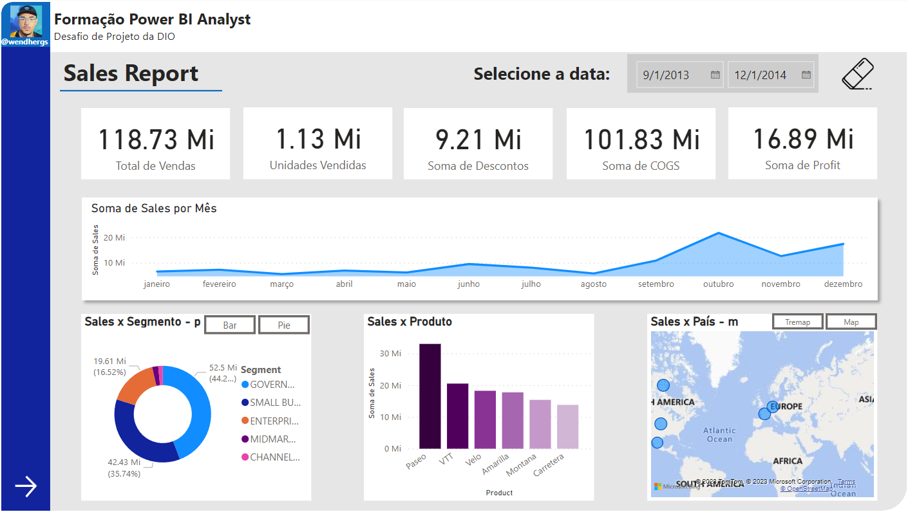
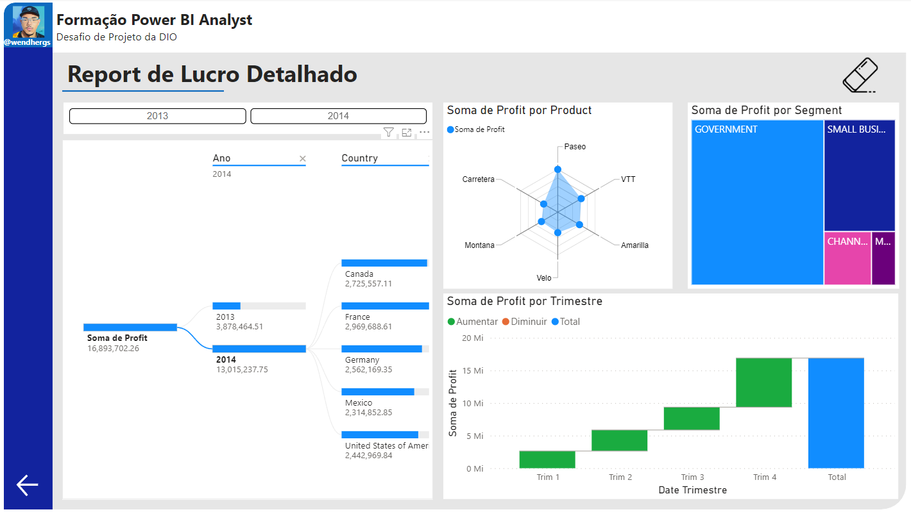

## Explorando IA Generativa em um Pipeline de ETL com Python

### **Descrição**

Neste vídeo, uma jornada prática explora a Ciência de Dados, abordando extração de dados, transformação com IA e carregamento em APIs. Isso ilustra o ciclo do pipeline ETL.

### **Entendendo o Desafio**

Agora, é a sua chance de criar um perfil de destaque na DIO! Aplique o que aprendeu neste projeto prático, crie seu próprio repositório no GitHub e enriqueça seu portfólio. Exploramos juntos a Ciência de Dados, incluindo um pipeline ETL e uso inovador da IA. Agora, desafie-se a aplicar esses conceitos em novos cenários, sem depender de APIs externas. Deixe sua criatividade fluir! 😎

### **Links Úteis**

1. **[colab.research.google.com](https://colab.research.google.com/drive/1SF_Q3AybFPozCcoFBptDSFbMk-6IVGF-?usp=sharing)**: Link do Notebook criado via Google Colab com todo o código-fonte desenvolvido neste Desafio de Projeto (Lab);
2. **[github.com/digitalinnovationone/santander-dev-week-2023-api](https://github.com/digitalinnovationone/santander-dev-week-2023-api)**: GitHub com a API desenvolvida para a Santander Dev Week 2023 com informações úteis (incluindo o link do Swagger e dados importantes sobre a disponibilidade da API). Relevante para quem quiser saber mais sobre o processo de criação da API RESTful consumi neste Lab.\\

### **Desafio Resolvido**

Neste desafio, melhorei a solução ETL (Extração, Transformação e Carga) para enriquecer os dados de usuários do Santander Dev Week 2023 com mensagens personalizadas sobre investimentos usando o modelo GPT-4 da OpenAI.

Passos Principais:

1. Extração (E): Extraí dados dos usuários de um arquivo CSV usando Pandas.
2. Transformação (T): Busquei informações detalhadas de usuários de uma API fictícia, filtrando e limpando os dados.
3. Geração de Mensagens Personalizadas: Criei mensagens personalizadas sobre investimentos para cada usuário usando a API da OpenAI.
4. Atualização de Usuários (Carga): Vinculei mensagens aos usuários e as carreguei de volta à API fictícia, com tratamento de erros.

Resultados e Aprendizados:

Minha solução demonstra a aplicação prática de conhecimentos em ciência de dados e IA em um cenário realista. Destaco a importância do tratamento de erros e da documentação para garantir confiabilidade e escalabilidade.

**[Desafio Revolvido](https://github.com/wendherSantos/bootcamp_santander_python/blob/main/02_trilha-python/desafio_eu_resolvido.py)**: Link do desafio resolvido :).

## Criando um Relatório de Vendas Elegante com Power BI

### **Descrição**

Criar um relatório mais elaborado com base na sample financials do Power BI. Os arquivos de dados estão disponíveis no github: https://github.com/julianazanelatto/power_bi_analyst.

Fiquem atentos a: 
- Estrutura definida 
- Botões de navegação que fornecem navegabilidade 
- Segmentadores utilizados e botões com imagem associado 
- Utilize os indicadores e botões para selecionar diferentes visuais sobre um mesmo assunto 

 Utilize os vídeos de passo a passo para criação dos elementos que compõem a primeira página do relatório: 
- Objetos que definem o layout do relatório 
- Gráficos (visuais) e os campos que os compõem 
- Botões para navegabilidade 
- Segmentadores de dados 

Lembre-se de: 
- Criar a segunda página do relatório 
- Publique o seu relatório no Power BI Service 
- Caso você tenha familiaridade fique livre para utilizar outros artifícios nos botões e outros 
- Submenta seu projeto através do link no github 

### **Desafio Resolvido**

Imagens da resolução do desafio:

**[Desafio Resolvido](https://github.com/wendherSantos/bootcamp_santander_python/tree/main/04_power-bi/project)**: Link do repositório com o desafio resolvido :).